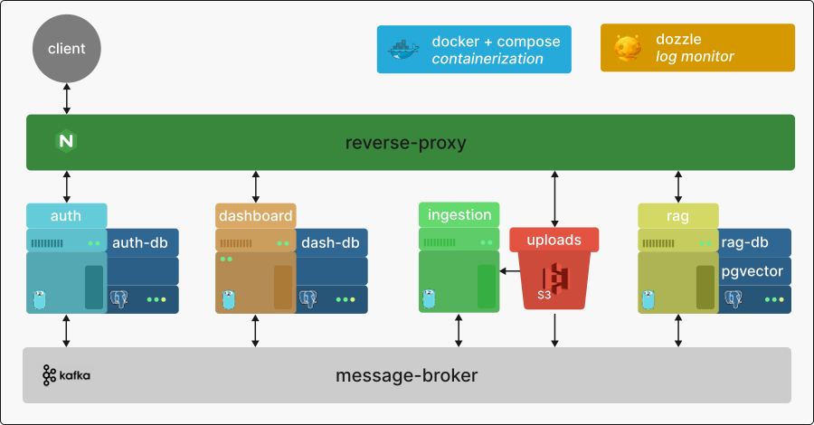

# Raggy - A RAG Pipeline

Raggy is a prototype RAG (Retrieval-Augmented Generation) pipeline built to explore distributed system design. The project applies enterprise-grade principles, using a microservice architecture to isolate core domains and leveraging Kafka to handle heavy document processing workloads asynchronously.

> [!NOTE]
> This project is currently a Work in Progress. Core functionality is implemented, additional features are still being integrated.

 

_A high-level overview of the services that make up the pipeline._

 

**Session Management:** Generates and manages Access and Refresh tokens to handle authentication and user sessions.

**Stateless:** Implements asymmetric public/private key token verification so downstream services can verify identity without querying a central database or the authentication service.

**Process Orchestration:** Provides the primary interface allowing document uploads to be created and scheduled for pipeline processing.

**Real-time Feedback:** Tracks and surfaces metrics regarding processing states and ingestion status directly to the client.

**Data Extraction:** Pulls raw files staged in AWS S3 storage as soon as an ingestion job triggers.

**Parsing & Chunking:** Processes the contents, breaking the raw input into chunks tailored for downstream vector embedding.

**Embedding Generation:** Converts text chunks into vector representations, handling the embeddings process either locally or via external APIs like Gemini.

**Contextual Querying:** Orchestrates the core RAG logic by retrieving relevant document chunks based on a user's prompt and feeding that grounded context into the LLM API to generate accurate answers.
